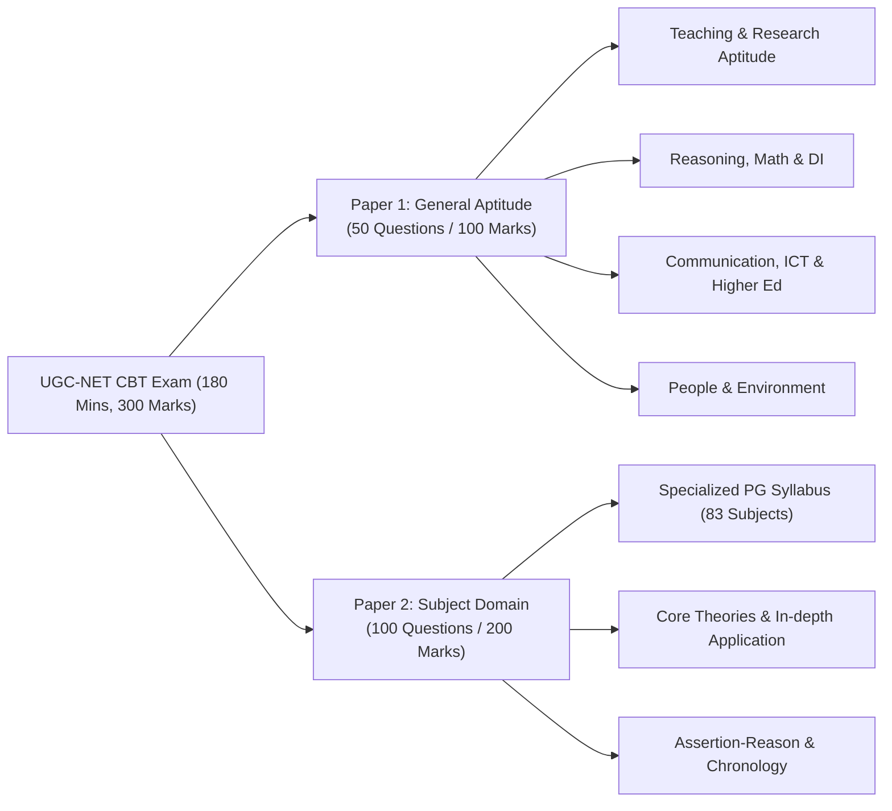
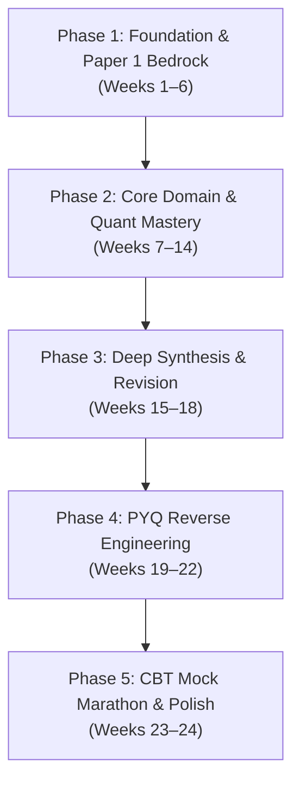
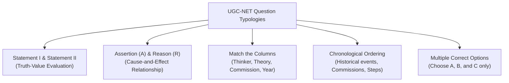

# University Grants Commission (UGC) NET / JRF — Master Plan & Preparation Roadmap

> **Target Exam**: UGC-NET (National Eligibility Test) & JRF (Junior Research Fellowship)  
> **Conducting Body**: National Testing Agency (NTA) on behalf of University Grants Commission (UGC)  
> **Frequency**: Twice a year (June & December cycles)  
> **Role & Eligibility**: 
> 1. Award of Junior Research Fellowship (JRF) & appointment as Assistant Professor
> 2. Appointment as Assistant Professor & admission to Ph.D.
> 3. Admission to Ph.D. only (Category 3 per UGC Gazette)  
> **Platform Alignment**: Techno Wallah (technoedu) Open Educational Resources (OER) Architecture

---

## 📑 Table of Contents

1. [Executive Summary & Exam Blueprint](#1-executive-summary--exam-blueprint)
2. [Exam Architecture, Pattern & Scoring](#2-exam-architecture-pattern--scoring)
3. [Paper 1: Complete 10-Unit Syllabus & Verified OER Links](#3-paper-1-complete-10-unit-syllabus--verified-oer-links)
   - [Unit I: Teaching Aptitude](#unit-i-teaching-aptitude)
   - [Unit II: Research Aptitude](#unit-ii-research-aptitude)
   - [Unit III: Reading Comprehension](#unit-iii-reading-comprehension)
   - [Unit IV: Communication](#unit-iv-communication)
   - [Unit V: Mathematical Reasoning and Aptitude](#unit-v-mathematical-reasoning-and-aptitude)
   - [Unit VI: Logical Reasoning (Western & Indian Logic)](#unit-vi-logical-reasoning-western--indian-logic)
   - [Unit VII: Data Interpretation (DI)](#unit-vii-data-interpretation-di)
   - [Unit VIII: Information and Communication Technology (ICT)](#unit-viii-information-and-communication-technology-ict)
   - [Unit IX: People, Development and Environment](#unit-ix-people-development-and-environment)
   - [Unit X: Higher Education System](#unit-x-higher-education-system)
4. [Paper 2: Domain Specific Syllabus & High-Enrollment Subjects](#4-paper-2-domain-specific-syllabus--high-enrollment-subjects)
   - [Subject 87: Computer Science & Applications](#subject-87-computer-science--applications)
   - [Subject 08: Commerce & Subject 17: Management](#subject-08-commerce--subject-17-management)
   - [Subject 01: Economics](#subject-01-economics)
   - [Subject 30: English Literature](#subject-30-english-literature)
   - [Subject 09: Education](#subject-09-education)
   - [Subject 02: Political Science & Subject 20: History](#subject-02-political-science--subject-20-history)
   - [Subject 05: Sociology](#subject-05-sociology)
   - [Subject 58: Law](#subject-58-law)
   - [Complete 83 Subjects Syllabus Repository](#complete-83-subjects-syllabus-repository)
5. [6-Month Comprehensive Master Roadmap (24 Weeks)](#5-6-month-comprehensive-master-roadmap-24-weeks)
6. [90-Day Express Fast-Track Roadmap (12 Weeks)](#6-90-day-express-fast-track-roadmap-12-weeks)
7. [Daily & Weekly Study Timetables](#7-daily--weekly-study-timetables)
8. [PYQ Reverse-Engineering & Question-Pattern Analysis](#8-pyq-reverse-engineering--question-pattern-analysis)
9. [Open Educational Resources (OER) Digital Library Directory](#9-open-educational-resources-oer-digital-library-directory)
10. [TechnoEdu Platform Integration Blueprint](#10-technoedu-platform-integration-blueprint)

---

## 1. Executive Summary & Exam Blueprint

The **UGC National Eligibility Test (UGC-NET)** determines the eligibility of Indian nationals for 'Assistant Professor' as well as for 'Junior Research Fellowship and Assistant Professor' in Indian universities and colleges. Per recent UGC guidelines, NET scores are also utilized for direct **Ph.D. admissions** across three eligibility categories.

### Key Objectives for Aspirants
* **Paper 1 Target Score**: `70+ / 100` (35+ correct questions out of 50).
* **Paper 2 Target Score**: `130+ / 200` (65+ correct questions out of 100).
* **Aggregate JRF Safe Target**: `200–210+ / 300` (67–70%+ depending on subject cutoff).
* **Assistant Professor Safe Target**: `170–185+ / 300` (57–62%+ depending on subject cutoff).

---

## 2. Exam Architecture, Pattern & Scoring

| Parameter | Specification | Notes |
|:---|:---|:---|
| **Mode of Examination** | Computer Based Test (CBT) | Administered across nationwide NTA test centres |
| **Duration** | **3 Hours (180 Minutes)** | Continuous test, **no break** between Paper 1 and Paper 2 |
| **Total Questions** | **150 Questions** (All Compulsory) | 50 in Paper 1 + 100 in Paper 2 |
| **Total Marks** | **300 Marks** | Objective Type Multiple Choice Questions (MCQs) |
| **Marking Scheme** | **+2 Marks** for each correct response | **No Negative Marking** for incorrect or unattempted answers |
| **Medium of Paper** | Bilingual: **English & Hindi** | Candidate selects during exam (except language-specific subjects) |



### 3 Eligibility Categories (New UGC Policy)
1. **Category 1**: Eligible for **Award of JRF & appointment as Assistant Professor** + admission to Ph.D.
2. **Category 2**: Eligible for **Appointment as Assistant Professor** + admission to Ph.D.
3. **Category 3**: Eligible for **Admission to Ph.D. only** (valid for 1 year; 70% weightage given to NET score + 30% to interview).

---

## 3. Paper 1: Complete 10-Unit Syllabus & Verified OER Links

Paper 1 tests general teaching ability, research inclination, cognitive skills, comprehension, logical thinking, general awareness of higher education, and environmental consciousness. Each unit typically carries **5 questions (10 marks)**.

---

### Unit I: Teaching Aptitude
* **Official Syllabus**:
  * **Teaching**: Concept, Objectives, Levels of teaching (Memory, Understanding and Reflective), Characteristics and basic requirements.
  * **Learner’s characteristics**: Characteristics of adolescent and adult learners (Academic, Social, Emotional and Cognitive), Individual differences.
  * **Factors affecting teaching**: Teacher, Learner, Support material, Instructional facilities, Learning environment and Institution.
  * **Methods of teaching in Institutions of higher learning**: Teacher-centred vs. Learner-centred methods; Offline vs. Online methods (Swayam, Swayamprabha, MOOCs etc.).
  * **Teaching Support System**: Traditional, Modern and ICT based.
  * **Evaluation Systems**: Elements and Characteristics of evaluation, Evaluation in Choice Based Credit System (CBCS) in higher education, Computer-based testing, Innovations in evaluation systems.
* **High-Yield Exam Focus**:
  * Bloom’s Taxonomy of Educational Objectives (Cognitive, Affective, Psychomotor domains).
  * Morris L. Bigge levels of teaching: Memory Level (Herbart), Understanding Level (Morrison), Reflective Level (Hunt).
  * Formative vs. Summative vs. Diagnostic vs. Norm-Referenced vs. Criterion-Referenced evaluation.
  * Four Quadrants of MOOCs (e-Tutorial, e-Content, Discussion Forum, Assessment).
* **Verified Free Study Materials & OER Links**:
  * 🌐 **UGC e-PG Pathshala (Education - Higher Education & Pedagogy)**: [epgp.inflibnet.ac.in](https://epgp.inflibnet.ac.in)
  * 📄 **IGNOU B.Ed / M.A. Education Pedagogy Modules**: [egyankosh.ac.in](https://egyankosh.ac.in/handle/123456789/46210)
  * 📺 **CEC UGC Video Lectures on Teaching Aptitude**: [cec.nic.in](https://cec.nic.in)
  * 🌐 **SWAYAM MOOCs Portal & Regulations**: [swayam.gov.in](https://swayam.gov.in)

---

### Unit II: Research Aptitude
* **Official Syllabus**:
  * **Research**: Meaning, Types, and Characteristics; Positivism and Post-positivistic approach to research.
  * **Methods of Research**: Experimental, Descriptive, Historical, Qualitative and Quantitative methods.
  * **Steps of Research**: Problem formulation, Hypothesis formulation, Research design, Data collection, Data analysis, Generalization.
  * **Thesis and Article writing**: Format and styles of referencing (APA, MLA, Chicago, etc.).
  * **Application of ICT in research**: Data collection tools, statistical software, reference managers.
  * **Research ethics**: Plagiarism, intellectual property rights, data fabrication, falsification.
* **High-Yield Exam Focus**:
  * Positivism (Quantitative, Empirical, Objective) vs. Post-Positivism (Interpretive, Qualitative, Subjective).
  * Sampling Techniques: Probability (Simple Random, Stratified, Cluster, Systematic) vs. Non-Probability (Purposive, Quota, Snowball, Convenience).
  * Type I Error (False Positive / rejecting true null hypothesis) vs. Type II Error (False Negative / failing to reject false null hypothesis).
  * UGC Regulations on Academic Integrity & Plagiarism (Level 0: up to 10%, Level 1: 10–40%, Level 2: 40–60%, Level 3: above 60%).
* **Verified Free Study Materials & OER Links**:
  * 📄 **IGNOU Research Methodology Courseware (MES-016 & MCO-03)**: [egyankosh.ac.in](https://egyankosh.ac.in/handle/123456789/24584)
  * 🌐 **Shodhganga (Indian Theses Repository & Referencing Styles)**: [shodhganga.inflibnet.ac.in](https://shodhganga.inflibnet.ac.in)
  * 🌐 **UGC e-PG Pathshala Research Methodology**: [epgp.inflibnet.ac.in](https://epgp.inflibnet.ac.in)
  * 📄 **OpenStax Research Methods & Statistics Handbook**: [openstax.org](https://openstax.org/details/books/introductory-statistics)

---

### Unit III: Reading Comprehension
* **Official Syllabus**:
  * A passage of text is given. Questions are asked based on the passage to be answered.
* **High-Yield Exam Focus**:
  * 5 questions directly based on an academic/socio-economic passage.
  * Identifying the primary theme, tone of the author, direct factual answers, vocabulary in context, and inferential deductions.
* **Mastery Strategy & Free Links**:
  * Practice reverse skimming: Read questions first, underline keywords, locate context in passage.
  * 📄 **UGC-NET Official PYQ Archive (Comprehension Passages)**: [ugcnet.nta.ac.in](https://ugcnet.nta.ac.in)
  * 🌐 **NDLI Reading and Comprehension Repository**: [ndl.iitkgp.ac.in](https://ndl.iitkgp.ac.in)

---

### Unit IV: Communication
* **Official Syllabus**:
  * **Communication**: Meaning, types and characteristics of communication.
  * **Effective communication**: Verbal and Non-verbal, Inter-Cultural and group communications, Classroom communication.
  * **Barriers to effective communication**: Physical, Psychological, Semantic, Cultural, Organizational.
  * **Mass-Media and Society**: Radio, Television, Press, Social Media, New media technologies.
* **High-Yield Exam Focus**:
  * Communication Models: Shannon-Weaver Linear Model, Berlo’s SMCR Model, Schramm’s Interactive Model, Westley & MacLean Model.
  * Non-verbal dimensions: Kinesics (body language), Proxemics (space), Chronemics (time), Haptics (touch), Paralanguage (vocal pitch, pauses).
  * Classroom Communication dynamics: Feedback loops, active listening, teacher immediacy, entropy, and noise.
* **Verified Free Study Materials & OER Links**:
  * 📄 **IGNOU Communication Skills Modules (BEGA-001)**: [egyankosh.ac.in](https://egyankosh.ac.in/handle/123456789/36881)
  * 🌐 **UGC e-PG Pathshala Media & Communication Studies**: [epgp.inflibnet.ac.in](https://epgp.inflibnet.ac.in)
  * 📺 **CEC UGC Lectures on Mass Communication**: [cec.nic.in](https://cec.nic.in)

---

### Unit V: Mathematical Reasoning and Aptitude
* **Official Syllabus**:
  * **Types of reasoning**: Inductive, Deductive, Analogical.
  * **Number series, Letter series, Codes and Relationships**.
  * **Mathematical Aptitude**: Fraction, Time & Distance, Ratio, Proportion and Percentage, Profit and Loss, Interest and Discounting, Averages, etc.
* **High-Yield Exam Focus**:
  * Percentage-Fraction conversion table ($1/6 = 16.66\%$, $1/7 = 14.28\%$, $1/8 = 12.5\%$, $1/9 = 11.11\%$, $1/11 = 9.09\%$).
  * Speed, Distance & Time: Relative speed of trains, upstream/downstream boats.
  * Coding-Decoding: Alphabet forward & backward rank values ($A=1 \dots Z=26$, $EJOTY=5, 10, 15, 20, 25$).
  * Blood Relations family tree diagrams.
* **Verified Free Study Materials & OER Links**:
  * 📄 **NCERT Mathematics Class 8–10 (Foundation Direct PDFs)**: [ncert.nic.in/textbook.php](https://ncert.nic.in/textbook.php)
  * 🌐 **Khan Academy Math Foundations & Arithmetic**: [khanacademy.org](https://www.khanacademy.org/math)
  * 🌐 **NPTEL Quantitative Reasoning & Problem Solving**: [nptel.ac.in](https://nptel.ac.in)

---

### Unit VI: Logical Reasoning (Western & Indian Logic)
* **Official Syllabus**:
  * **Understanding the structure of arguments**: Argument forms, structure of categorical propositions, Mood and Figure, Formal and Informal fallacies, Uses of language, Connotations and denotations of terms, Classical square of opposition.
  * **Evaluating and distinguishing deductive and inductive reasoning**.
  * **Analogies**: Venn diagram (Simple and multiple use for establishing validity of arguments).
  * **Indian Logic: Means of knowledge (Pramanas)**:
    * Pratyaksha (Perception), Anumana (Inference), Upamana (Comparison), Shabda (Verbal testimony), Arthapatti (Implication), Anupalabdhi (Non-apprehension).
  * **Structure and kinds of Anumana**: Vyapti (invariable relation), Hetvabhasa (fallacies of inference).
* **High-Yield Exam Focus**:
  * **Classical Square of Opposition**:
    * Contradictories ($A \leftrightarrow O$, $E \leftrightarrow I$): If one is True, the other is False.
    * Contraries ($A \leftrightarrow E$): Both cannot be True together, but both can be False.
    * Sub-contraries ($I \leftrightarrow O$): Both can be True together, but both cannot be False.
    * Subalternation ($A \to I$, $E \to O$): Truth flows downward, Falsehood flows upward.
  * **Fallacies (Hetvabhasa)**:
    * *Savyabhichara* (Irregular middle term / wandering hetu).
    * *Viruddha* (Contradictory middle term).
    * *Satpratipaksha* (Inferentially contradicted middle term).
    * *Asiddha* (Unproved middle: Ashrayasiddha, Svarupasiddha, Vyapyatvasiddha).
    * *Badhita* (Non-inferentially contradicted middle term / sublated).
  * Five members of Indian Syllogism (*Pancha Avayava*): Pratijna (Proposition), Hetu (Reason), Udaharana (Example with Vyapti), Upanaya (Application), Nigamana (Conclusion).
* **Verified Free Study Materials & OER Links**:
  * 📄 **UGC e-PG Pathshala Philosophy: Indian Logic & Epistemology**: [epgp.inflibnet.ac.in](https://epgp.inflibnet.ac.in)
  * 📄 **IGNOU Philosophy Modules (BPY-004 / BPY-008 Indian Epistemology)**: [egyankosh.ac.in](https://egyankosh.ac.in/handle/123456789/27170)
  * 🌐 **Stanford Encyclopedia of Philosophy (Indian Logic & Nyaya)**: [plato.stanford.edu](https://plato.stanford.edu/entries/logic-indic/)

---

### Unit VII: Data Interpretation (DI)
* **Official Syllabus**:
  * Sources, acquisition and classification of Data.
  * Quantitative and Qualitative Data.
  * Graphical representation (Bar-chart, Histograms, Pie-chart, Table-chart and Line-chart) and Mapping of Data.
  * Data Interpretation.
  * Data and Governance.
* **High-Yield Exam Focus**:
  * Predominantly **Table Charts** involving percentages, ratios, averages, and multi-year comparisons.
  * Missing Data Table problems (calculating missing values before answering questions).
  * Fast approximation techniques to eliminate unreasonable options without exact long division.
* **Verified Free Study Materials & OER Links**:
  * 📄 **NCERT Statistics for Economics (Class 11 Direct PDF)**: [ncert.nic.in/textbook/pdf/kest1.pdf](https://ncert.nic.in/textbook/pdf/kest1.pdf)
  * 🌐 **NTA Mock Practice DI Engine**: [nta.ac.in/quiz](https://nta.ac.in/quiz)
  * 🌐 **Khan Academy Data & Statistics Practice**: [khanacademy.org](https://www.khanacademy.org/math/statistics-probability)

---

### Unit VIII: Information and Communication Technology (ICT)
* **Official Syllabus**:
  * **ICT**: General abbreviations and terminology.
  * **Basics of Internet, Intranet, E-mail, Audio and Video-conferencing**.
  * **Digital initiatives in higher education**: SWAYAM, SWAYAM PRABHA, NDL, e-ShodhSindhu, Shodhganga, ShodhGangotri, DigiLocker, NAD, e-Yantra, Virtual Labs, SAMARTH.
  * **ICT and Governance**.
* **High-Yield Exam Focus**:
  * Computer Memory hierarchy: Registers > Cache > RAM/ROM > SSD > HDD > Optical Discs.
  * Unit conversions: Bit, Nibble, Byte, KB, MB, GB, TB, PB, EB, ZB, YB ($2^{10}, 2^{20}, 2^{30}$, etc.).
  * Number System Conversions: Binary, Octal, Decimal, Hexadecimal.
  * Cybersecurity threats: Phishing, Ransomware, Trojan Horse, Spyware, Spoofing, Denial of Service (DoS).
  * Networking: IP Addresses (IPv4 vs. IPv6), MAC Address, Router, Switch, Gateway, HTTP vs. HTTPS, SMTP, POP3, IMAP.
* **Verified Free Study Materials & OER Links**:
  * 📄 **NCERT Class 11 Informatics Practices & Computer Science**: [ncert.nic.in/textbook.php](https://ncert.nic.in/textbook.php)
  * 🌐 **Ministry of Education Digital Initiatives Portal**: [moe.gov.in](https://www.education.gov.in/digital-education)
  * 🌐 **INFLIBNET Digital Initiatives Overview**: [inflibnet.ac.in](https://www.inflibnet.ac.in)
  * 📄 **OpenStax Computer Science / Information Systems**: [openstax.org](https://openstax.org)

---

### Unit IX: People, Development and Environment
* **Official Syllabus**:
  * **Development and environment**: Millennium development goals (MDGs) and Sustainable development goals (SDGs).
  * **Human and environment interaction**: Anthropogenic activities and their impacts on environment.
  * **Environmental issues**: Local, Regional and Global; Air pollution, Water pollution, Soil pollution, Noise pollution, Waste (solid, liquid, biomedical, hazardous, electronic), Climate change and its Socio-Economic and Political dimensions.
  * **Impacts of pollutants on human health**.
  * **Natural and energy resources**: Solar, Wind, Soil, Hydro, Geothermal, Biomass, Nuclear and Forests.
  * **Natural hazards and disasters**: Mitigation strategies.
  * **Environmental Protection Act (1986)**, National Action Plan on Climate Change (NAPCC - 8 Missions), International agreements/efforts: Montreal Protocol, Rio Summit, Convention on Biodiversity (CBD), Kyoto Protocol, Paris Agreement, International Solar Alliance (ISA).
* **High-Yield Exam Focus**:
  * **SDGs (2015–2030)**: 17 Goals, 169 Targets (Goal 1: No Poverty, Goal 4: Quality Education, Goal 7: Clean Energy, Goal 13: Climate Action).
  * **MDGs (2000–2015)**: 8 Goals, 21 Targets.
  * **NAPCC 8 Missions**: Solar Mission, Enhanced Energy Efficiency, Sustainable Habitat, Water Mission, Sustaining Himalayan Ecosystem, Green India, Sustainable Agriculture, Strategic Knowledge for Climate Change.
  * **International Protocols**: Montreal (Ozone depleting substances / CFCs - Kigali amendment), Kyoto (GHG reduction), Paris Agreement (limit warming below $2^\circ\text{C}$ / target $1.5^\circ\text{C}$).
  * **Air Quality Index (AQI)**: 8 pollutants ($PM_{10}, PM_{2.5}, NO_2, SO_2, CO, O_3, NH_3, Pb$).
  * India's Renewable Energy targets: 500 GW non-fossil capacity by 2030, Net-Zero by 2070.
* **Verified Free Study Materials & OER Links**:
  * 📄 **NCERT Class 12 Biology - Ecology & Environment (Direct PDFs)**: [ncert.nic.in/textbook/pdf/lebo1.pdf](https://ncert.nic.in/textbook/pdf/lebo1.pdf)
  * 🌐 **UN Sustainable Development Knowledge Platform (SDGs)**: [sdgs.un.org](https://sdgs.un.org/goals)
  * 🌐 **MoEFCC (Ministry of Environment, Forest and Climate Change)**: [moef.gov.in](https://moef.gov.in)
  * 📄 **IGNOU Environment Studies Courseware (AECC / BEVAE-181)**: [egyankosh.ac.in](https://egyankosh.ac.in/handle/123456789/53123)

---

### Unit X: Higher Education System
* **Official Syllabus**:
  * **Institutions of higher learning and education in ancient India**.
  * **Evolution of higher learning and research in Post-Independence India**.
  * **Oriental, Conventional and Non-conventional learning programmes in India**.
  * **Professional, Technical and Skill Based education**.
  * **Value education and environmental education**.
  * **Policies, Governance, and Administration**.
* **High-Yield Exam Focus**:
  * Ancient Universities: Takshashila (Taxila), Nalanda, Vikramashila, Vallabhi, Odantapuri, Jagaddala; Scholars: Panini, Chanakya, Jivaka, Xuanzang (Hiuen Tsang).
  * Pre-Independence Commissions: Charter Act (1813), Macaulay’s Minute (1835), Wood’s Despatch (1854 - Magna Carta), Hunter Commission (1882), Universities Commission / Curzon (1902), Sadler Commission (1917), Hartog Committee (1929), Wardha Scheme / Basic Education (1937), Sargent Report (1944).
  * Post-Independence Commissions: Radhakrishnan Commission (1948–49 - University Education), Mudaliar Commission (1952–53 - Secondary Education), Kothari Commission (1964–66 - 10+2+3 pattern & 6% of GDP on education), National Policy on Education (1968, 1986, 1992 POA).
  * **National Education Policy 2020 (NEP 2020)**: $5+3+3+4$ curricular structure, Higher Education Commission of India (HECI) with 4 verticals (NHERC, NAC, HEGC, GEC), ABC (Academic Bank of Credits), MERUs, National Research Foundation (NRF).
  * Regulatory & Accreditations Bodies: UGC, AICTE, NAAC, NIRF (parameters & recent rankings).
* **Verified Free Study Materials & OER Links**:
  * 📄 **NEP 2020 Official Policy Document (Ministry of Education)**: [education.gov.in](https://www.education.gov.in/sites/upload_files/mhrd/files/NEP_Final_English_0.pdf)
  * 🌐 **UGC Official Website & Regulations**: [ugc.ac.in](https://www.ugc.gov.in)
  * 📄 **IGNOU Higher Education System Modules (MES-101 / MES-102)**: [egyankosh.ac.in](https://egyankosh.ac.in/handle/123456789/46215)
  * 🌐 **NIRF Ranking Framework & Metrics**: [nirfindia.org](https://www.nirfindia.org)

---

## 4. Paper 2: Domain Specific Syllabus & High-Enrollment Subjects

Paper 2 consists of **100 questions (200 marks)** based on the post-graduate syllabus chosen by the candidate. Below is the curated roadmap, structural syllabus, and verified OER repositories for the highest-enrollment disciplines.

---

### Subject 87: Computer Science & Applications
* **Core 10 Units**:
  1. Discrete Structures and Optimization (Set theory, Propositional logic, Group theory, Combinatorics, Graph theory, LPP).
  2. Computer System Architecture (Digital logic, Boolean algebra, CPU organization, Microprogramming, Memory hierarchy, Pipelining).
  3. Programming Languages and Computer Graphics (C/C++, OOPs, 2D/3D transformations, Clipping algorithms).
  4. Database Management Systems (ER model, Relational algebra, SQL, Normalization 1NF to BCNF/5NF, Transactions & Concurrency control, NoSQL).
  5. System Software and Operating Systems (Assemblers/Compilers, Process management, CPU scheduling, Synchronization & Semaphores, Deadlocks, Virtual memory, Storage management).
  6. Software Engineering (Software process models, Agile, Requirements engineering, Architecture design, Testing & Verification, Software metrics).
  7. Data Structures and Algorithms (Asymptotic notation, Divide & Conquer, Greedy, DP, Graph algorithms, NP-Completeness).
  8. Theory of Computation and Compilers (Finite Automata, Regular expressions, CFG, Pushdown Automata, Turing Machines, Decidability, Lexical analysis, Parsing, Code generation).
  9. Data Communication and Computer Networks (OSI & TCP/IP models, Data link layer & MAC protocols, Routing algorithms, Transport protocols TCP/UDP, Network security & Cryptography).
  10. Artificial Intelligence (Search techniques $A^*, AO^*$, Knowledge representation, Fuzzy logic, Genetic algorithms, Artificial Neural Networks).
* **Curated Open Educational Resources (OER)**:
  * 🌐 **NPTEL Computer Science Disciplines**: [nptel.ac.in](https://nptel.ac.in)
  * 🌐 **MIT OpenCourseWare EECS Modules**: [ocw.mit.edu](https://ocw.mit.edu/courses/electrical-engineering-and-computer-science/)
  * 📄 **UGC e-PG Pathshala Computer Science Modules (All 10 Papers)**: [epgp.inflibnet.ac.in](https://epgp.inflibnet.ac.in)
  * 📄 **IGNOU Master of Computer Applications (MCA) SLM**: [egyankosh.ac.in](https://egyankosh.ac.in/handle/123456789/101)

---

### Subject 08: Commerce & Subject 17: Management
* **Core Domains**:
  * Business Environment and International Business (FDI, Balance of Payments, WTO, Regional Trade Agreements).
  * Accounting and Auditing (Corporate accounting, Cost & Management accounting, Auditing standards, IND-AS, IFRS).
  * Business Finance & Financial Management (Capital structure, Cost of capital, Capital budgeting, Working capital management).
  * Business Statistics and Research Methods (Probability, Sampling distributions, Hypothesis testing $z, t, F, \chi^2$ tests).
  * Business Management & Human Resource Management (Theories of management, Leadership, Motivation, Performance appraisal, Industrial relations).
  * Banking and Financial Institutions (RBI monetary policy, NPAs, Basel Norms, Capital markets, NBFCs).
  * Marketing Management (4Ps & 7Ps, Segmentation, Targeting, Positioning, Consumer behavior, Digital marketing).
  * Legal Aspects of Business (Indian Contract Act 1872, Sale of Goods Act, Companies Act 2013, Consumer Protection Act 2019, IT Act 2000).
  * Income-tax and Corporate Tax Planning (Residential status, Heads of income, Deductions, Corporate tax).
* **Curated Open Educational Resources (OER)**:
  * 📄 **OpenStax Principles of Accounting Vol 1 & 2**: [openstax.org](https://openstax.org/details/books/principles-accounting-volume-1-financial-accounting)
  * 📄 **OpenStax Principles of Finance & Management**: [openstax.org](https://openstax.org/details/books/principles-finance)
  * 📄 **UGC e-PG Pathshala Commerce & Management Courses**: [epgp.inflibnet.ac.in](https://epgp.inflibnet.ac.in)
  * 📄 **IGNOU M.Com & MBA Master's SLM**: [egyankosh.ac.in](https://egyankosh.ac.in/handle/123456789/34)

---

### Subject 01: Economics
* **Core Domains**:
  * Microeconomics (Consumer choice, Production theory, Market structures, General equilibrium, Welfare economics).
  * Macroeconomics (Classical, Keynesian, Monetarist, New Classical, IS-LM, Philips curve).
  * Statistics and Econometrics (Regression models, Heteroscedasticity, Multicollinearity, Time series analysis).
  * Mathematical Economics (Differential calculus, Matrix algebra, Optimization techniques).
  * International Economics (Comparative advantage, Heckscher-Ohlin, Tariffs, Exchange rate regimes).
  * Public Economics (Market failure, Public goods, Externalities, Taxation, Fiscal policy).
  * Money and Banking (Money supply components, Central banking, Inflation targeting).
  * Growth and Development (Harrod-Domar, Solow, Endogenous growth, Human development indices).
  * Indian Economy (Agricultural reforms, Industrial policy, Trade reforms, Infrastructure, Poverty & Unemployment).
* **Curated Open Educational Resources (OER)**:
  * 📄 **OpenStax Principles of Economics 3e (Full Book PDF)**: [assets.openstax.org](https://assets.openstax.org/oscms-prodcms/media/documents/PrinciplesEconomics2e.pdf)
  * 🌐 **MIT OCW Principles of Microeconomics & Macroeconomics**: [ocw.mit.edu](https://ocw.mit.edu/courses/economics/)
  * 📄 **UGC e-PG Pathshala Economics**: [epgp.inflibnet.ac.in](https://epgp.inflibnet.ac.in)
  * 📄 **IGNOU M.A. Economics (MEC Courseware)**: [egyankosh.ac.in](https://egyankosh.ac.in/handle/123456789/1085)

---

### Subject 30: English Literature
* **Core Domains**:
  * Drama, Poetry, Fiction & Short Story, Non-Fictional Prose across British, American, Post-Colonial, and Indian Writing in English.
  * Language: Basic concepts, theories & pedagogy; English in Use.
  * English in India: History, evolution and futures.
  * Cultural Studies.
  * Literary Criticism (Classical to New Criticism).
  * Literary Theory post-World War II (Structuralism, Post-structuralism, Deconstruction, Psychoanalysis, Feminism, Postcolonialism, Ecocriticism).
* **Curated Open Educational Resources (OER)**:
  * 📄 **UGC e-PG Pathshala English Literature (Modules on Literary Theory & Texts)**: [epgp.inflibnet.ac.in](https://epgp.inflibnet.ac.in)
  * 📄 **IGNOU M.A. English (MEG Programme SLM)**: [egyankosh.ac.in](https://egyankosh.ac.in/handle/123456789/1179)
  * 🌐 **Stanford Encyclopedia of Philosophy (Literary Theory & Aesthetics)**: [plato.stanford.edu](https://plato.stanford.edu)
  * 🌐 **Project Gutenberg (Public Domain World Literature)**: [gutenberg.org](https://www.gutenberg.org)

---

### Subject 09: Education
* **Core Domains**:
  * Philosophical & Sociological Foundations of Education (Sankhya, Vedanta, Buddhism, Jainism, Idealism, Realism, Pragmatism, Naturalism).
  * History, Politics and Economics of Education.
  * Learner and Learning Process (Theories of intelligence, Personality, Motivation, Guidance and Counselling).
  * Teacher Education (Pre-service and in-service models, Agencies: NCERT, NCTE, SCERT).
  * Curriculum Studies (Models of curriculum design, Implementation, Evaluation).
  * Research in Education (Scientific inquiry, Types of research, Parametric and non-parametric tools).
  * Pedagogy, Andragogy and Assessment.
  * Technology in/for Education (ICT, E-learning platforms, Systems approach).
  * Educational Management, Administration and Leadership.
  * Inclusive Education (Disabilities, Rights of Persons with Disabilities Act 2016, Inclusive classroom strategies).
* **Curated Open Educational Resources (OER)**:
  * 📄 **UGC e-PG Pathshala Education (16 Specialized Papers)**: [epgp.inflibnet.ac.in](https://epgp.inflibnet.ac.in)
  * 📄 **IGNOU M.A. Education / M.Ed Courseware**: [egyankosh.ac.in](https://egyankosh.ac.in/handle/123456789/46210)
  * 📄 **NCERT National Curriculum Frameworks & Position Papers**: [ncert.nic.in](https://ncert.nic.in)

---

### Subject 02: Political Science & Subject 20: History
* **Political Science Units**: Political Theory, Political Thought (Western & Indian), Indian Political Thought, Comparative Political Analysis, International Relations, India’s Foreign Policy, Political Institutions in India, Political Processes in India, Public Administration, Governance and Public Policy in India.
* **History Units**: Negotiating the Sources, Pastoralism to State Formation, State & Society in Ancient India, Early Medieval India, Medieval Society & Sultanate, Mughal Empire & Economy, British Conquest & Colonial Rule, Rise of Modern Indian Nationalism, Post-Independence India, Historical Method, Research & Historiography.
* **Curated Open Educational Resources (OER)**:
  * 📄 **UGC e-PG Pathshala Political Science & History**: [epgp.inflibnet.ac.in](https://epgp.inflibnet.ac.in)
  * 📄 **IGNOU M.A. Political Science (MPS) & History (MAH) Modules**: [egyankosh.ac.in](https://egyankosh.ac.in)
  * 📄 **NCERT Class 11–12 History & Political Science Textbooks**: [ncert.nic.in/textbook.php](https://ncert.nic.in/textbook.php)
  * 📄 **OpenStax US & World History (Open Textbook PDFs)**: [openstax.org](https://openstax.org/details/books/world-history-volume-2)

---

### Subject 05: Sociology
* **Core Domains**: Sociological Concepts and Structures; Sociological Theory (Classical: Marx, Weber, Durkheim; Modern: Parsons, Merton; Post-Modern/Post-Structural: Foucault, Bourdieu); Methodology and Methods; Basic Institutions; Rural and Urban Transformations; State, Politics and Development; Economy and Society; Environment and Society; Family, Marriage and Kinship; Science, Technology and Society; Culture and Symbolic Transformations.
* **Curated Open Educational Resources (OER)**:
  * 📄 **OpenStax Introduction to Sociology 3e**: [openstax.org](https://openstax.org/details/books/introduction-sociology-3e)
  * 📄 **UGC e-PG Pathshala Sociology**: [epgp.inflibnet.ac.in](https://epgp.inflibnet.ac.in)
  * 📄 **IGNOU M.A. Sociology (MSO SLM Modules)**: [egyankosh.ac.in](https://egyankosh.ac.in/handle/123456789/1086)

---

### Subject 58: Law
* **Core Domains**: Jurisprudence; Constitutional and Administrative Law; Public International Law and IHL; Law of Crimes; Law of Torts and Consumer Protection; Commercial Law (Contracts, Companies, Partnership, Negotiable Instruments); Family Law; Environment and Human Rights Law; Intellectual Property Rights and Information Technology Law; Comparative Public Law and Systems of Governance.
* **Curated Open Educational Resources (OER)**:
  * 📄 **UGC e-PG Pathshala Law (NLUs Collaboration)**: [epgp.inflibnet.ac.in](https://epgp.inflibnet.ac.in)
  * 📄 **IGNOU LL.M. Courseware & Human Rights Modules**: [egyankosh.ac.in](https://egyankosh.ac.in)
  * 🌐 **Indian Kanoon Judicial Precedents**: [indiankanoon.org](https://indiankanoon.org)

---

### Complete 83 Subjects Syllabus Repository
Official subject-wise updated syllabi for all 83 disciplines are maintained directly by the University Grants Commission:
* 🌐 **UGC NET Official Subject Syllabi Archive**: [ugcnetonline.in/syllabus-new.php](https://ugcnetonline.in/syllabus-new.php)
* 🌐 **NTA UGC-NET Information Portal**: [ugcnet.nta.ac.in](https://ugcnet.nta.ac.in)

---

## 5. 6-Month Comprehensive Master Roadmap (24 Weeks)

A calibrated 24-week plan designed for complete conceptual mastery, extensive question practice, and high-percentile JRF qualification.



---

### Phase 1: Foundation & Paper 1 Bedrock (Weeks 1 to 6)
* **Goal**: Build an unbreakable foundation in theoretical Paper 1 units while initiating the first 30% of Paper 2.
* **Weekly Breakdown**:
  * **Week 1**:
    * Paper 1: Unit I (Teaching Aptitude) — Levels of teaching, Learner characteristics, Bloom's Taxonomy.
    * Paper 2: Unit 1 (Fundamentals / Foundational Concepts).
    * Activity: Read e-PG Pathshala Modules, solve 50 PYQs on Teaching Aptitude.
  * **Week 2**:
    * Paper 1: Unit I (Teaching Aptitude) — Methods of teaching, CBCS, MOOCs/SWAYAM, Evaluation systems.
    * Paper 2: Unit 1 completion & Unit 2 start.
    * Activity: Prepare concise 2-page summary sheets for Evaluation methods.
  * **Week 3**:
    * Paper 1: Unit II (Research Aptitude) — Positivism vs. Post-positivism, Types of research, Steps of research.
    * Paper 2: Unit 2 deep dive.
    * Activity: Tabulate all research types with real-world research problem examples.
  * **Week 4**:
    * Paper 1: Unit II (Research Aptitude) — Sampling methods, Hypotheses testing ($z, t, F$ tests, Type I/II errors), Thesis formatting, Research ethics & Plagiarism norms.
    * Paper 2: Unit 2 completion & Unit 3 start.
    * Activity: Solve 60 PYQs on Research Aptitude.
  * **Week 5**:
    * Paper 1: Unit IV (Communication) — Types, models, non-verbal (kinesics, proxemics), classroom dynamics & barriers.
    * Paper 2: Unit 3 completion.
    * Activity: Make a flow chart of communication models (Shannon, Berlo, Schramm).
  * **Week 6**:
    * Paper 1: Unit III (Reading Comprehension) + Phase 1 Integrated Revision.
    * Paper 2: Consolidate Units 1, 2, and 3.
    * Activity: 5 Reading Comprehension speed drills + 100-question Paper 1 combined test.

---

### Phase 2: Core Domain & Quant Mastery (Weeks 7 to 14)
* **Goal**: Conquer numerical, analytical, and logical units in Paper 1 while covering 70% of Paper 2.
* **Weekly Breakdown**:
  * **Week 7**:
    * Paper 1: Unit V (Mathematical Aptitude) — Number series, Letter series, Coding-Decoding, Blood relations.
    * Paper 2: Unit 4 (Domain Core).
  * **Week 8**:
    * Paper 1: Unit V (Mathematical Aptitude) — Percentages, Ratios, Profit & Loss, Simple and Compound Interest, Speed & Distance.
    * Paper 2: Unit 4 completion & Unit 5 start.
    * Activity: Memorize fractional equivalents and speed-math shortcuts.
  * **Week 9**:
    * Paper 1: Unit VII (Data Interpretation) — Table charts, Pie charts, Bar graphs.
    * Paper 2: Unit 5 completion.
    * Activity: Practice 2 complex table DI sets daily from 2021–2024 papers.
  * **Week 10**:
    * Paper 1: Unit VI (Logical Reasoning - Western) — Square of Opposition, Categorical Propositions, Syllogisms, Mood & Figure.
    * Paper 2: Unit 6 (Domain Core).
    * Activity: Draw the Square of Opposition chart; practice 40 truth-value deduction questions.
  * **Week 11**:
    * Paper 1: Unit VI (Logical Reasoning - Indian Logic) — 6 Pramanas, Vyapti, Hetvabhasa (Fallacies of Inference).
    * Paper 2: Unit 6 completion & Unit 7 start.
    * Activity: Build flashcards for all 5 Hetvabhasa types with classical Sanskrit examples.
  * **Week 12**:
    * Paper 1: Unit VIII (ICT) — Hardware, Memory hierarchy, Binary/Hexadecimal conversions, Internet, Protocols.
    * Paper 2: Unit 7 completion.
    * Activity: Tabulate all government digital education portals (SWAYAM, NDL, e-Yantra, Shodhganga).
  * **Week 13**:
    * Paper 1: Unit IX (People, Development & Environment) — SDGs vs. MDGs, Air/Water pollutants, AQI parameters.
    * Paper 2: Unit 8 start.
  * **Week 14**:
    * Paper 1: Unit IX (People, Development & Environment) — NAPCC 8 Missions, Montreal, Kyoto, Paris Agreements, ISA, Energy targets.
    * Paper 2: Unit 8 completion.
    * Activity: Make a timeline chart of global environmental conventions from Stockholm 1972 to Paris 2015.

---

### Phase 3: Deep Synthesis & Revision (Weeks 15 to 18)
* **Goal**: Cover the remaining Paper 1 & Paper 2 units and complete the first full syllabus revision cycle.
* **Weekly Breakdown**:
  * **Week 15**:
    * Paper 1: Unit X (Higher Education System) — Ancient universities, British education committees (Macaulay to Sargent).
    * Paper 2: Unit 9 start.
  * **Week 16**:
    * Paper 1: Unit X (Higher Education System) — Post-independence commissions, NEP 2020 structure, Statutory bodies (UGC, AICTE, NAAC, NIRF).
    * Paper 2: Unit 9 completion & Unit 10 start.
  * **Week 17**:
    * Paper 1: Rapid revision of Units 1 to 5; Formula drills.
    * Paper 2: Unit 10 completion (Syllabus 100% completed).
  * **Week 18**:
    * Paper 1: Rapid revision of Units 6 to 10; Government scheme updates.
    * Paper 2: First holistic revision of Units 1 to 5.
    * Milestone: Take a full-length baseline 180-minute CBT Mock test.

---

### Phase 4: PYQ Reverse Engineering (Weeks 19 to 22)
* **Goal**: Analyze the last 10 exam cycles (5 years of bi-annual papers) to internalize the examiner's mental model.
* **Weekly Breakdown**:
  * **Week 19**: Solve UGC-NET 2024 (June & Dec Cycles) — Paper 1 & Paper 2.
    * Document unknown terms and options in an **Error Log Notebook**.
  * **Week 20**: Solve UGC-NET 2023 (June & Dec Cycles) — Deep dive into Assertion-Reason and matching patterns.
  * **Week 21**: Solve UGC-NET 2022 (Merged Cycles) — Focus on Indian Logic, NEP 2020 questions, and domain depth.
  * **Week 22**: Solve UGC-NET 2021 & 2020 cycles — Timed section-wise practice.

---

### Phase 5: CBT Mock Marathon & Polish (Weeks 23 to 24)
* **Goal**: Peak mental conditioning, strict 3-hour time simulation, and zero-defect accuracy.
* **Weekly Breakdown**:
  * **Week 23**:
    * Take 3 Full-Length 180-Minute Mocks (NTA CBT Interface).
    * Conduct a 2-hour post-mock autopsy for every test: categorize errors into Conceptual, Misreading, or Calculation.
    * Revise high-frequency tables (Square of Opposition, SDGs, NEP 2020 verticals, Referencing styles).
  * **Week 24**:
    * Take 2 Full-Length Mocks.
    * Read only handwritten micro-notes, formula sheets, and the Error Log Notebook.
    * Cease heavy problem-solving 24 hours prior to the test; mental calibration and rest.

---

## 6. 90-Day Express Fast-Track Roadmap (12 Weeks)

Designed for working professionals, post-graduate final-year students, or repeat candidates aiming to optimize their score under time constraints.

| Week | Focus Area | Paper 1 Priority | Paper 2 Priority | Deliverable / Output |
|:---:|:---|:---|:---|:---|
| **W1** | Foundation | Unit 1 (Teaching Aptitude) | High-Weightage Units 1 & 2 | 40 PYQs + Notes |
| **W2** | Research Rigor | Unit 2 (Research Aptitude) | Unit 3 | Sampling & Ethics Matrix |
| **W3** | Reasoning Core | Unit 5 (Math) & Unit 3 (Comprehension) | Unit 4 | Speed-math table + 5 RC sets |
| **W4** | Logic & Fallacies | Unit 6 (Western & Indian Logic) | Unit 5 | Square of Opposition + Hetvabhasa |
| **W5** | DI & Data Skills | Unit 7 (Data Interpretation) | Unit 6 | 15 Table DI Problem Sets |
| **W6** | Digital & ICT | Unit 8 (ICT Concepts & Initiatives) | Unit 7 | Memory hierarchy + Portals list |
| **W7** | Ecology & Goals | Unit 9 (People, Dev & Environment) | Unit 8 | SDGs + Protocols cheat sheet |
| **W8** | Higher Education | Unit 10 (Ancient Ed & NEP 2020) | Unit 9 | Commissions timeline + NEP 2020 |
| **W9** | Domain Finish | Rapid Revision (Units 1 to 5) | Unit 10 completion | Full Syllabus Covered |
| **W10** | PYQ Sprint 1 | 2023–2024 Exam Papers | Domain PYQs 2023–2024 | Error Log Analysis |
| **W11** | PYQ Sprint 2 | 2021–2022 Exam Papers | Domain PYQs 2021–2022 | Weak-area reinforcement |
| **W12** | Mock Finale | 4 Full-Length CBT Simulations | High-Yield Micro-Revision | Time & Exam Readiness |

---

## 7. Daily & Weekly Study Timetables

### Plan A: Full-Time Aspirant Schedule (8–9 Hours/Day)

| Time Slot | Duration | Component | Activity |
|:---|:---:|:---|:---|
| **07:00 – 09:00** | 2.0 hrs | **Paper 1 Concept Study** | Theory reading (Higher Ed / People & Env / Teaching / Research) |
| **09:00 – 10:00** | 1.0 hr | *Breakfast & Mind Refresh* | Healthy physical break, brisk walk |
| **10:00 – 12:30** | 2.5 hrs | **Paper 2 Core Subject Part 1** | Primary subject theory, e-PG Pathshala text reading & note making |
| **12:30 – 14:00** | 1.5 hrs | *Lunch & Rest* | Re-energize |
| **14:00 – 15:30** | 1.5 hrs | **Paper 1 Analytical Skills** | Math reasoning, DI sets, Indian logic questions, Syllogisms |
| **15:30 – 16:00** | 0.5 hr | *Tea Break* | Offline break |
| **16:00 – 18:30** | 2.5 hrs | **Paper 2 Core Subject Part 2** | Advanced domain problems, theorems, case studies, or critical theory |
| **18:30 – 19:30** | 1.0 hr | *Exercise / Outdoor Leisure* | Mental decompaction |
| **19:30 – 21:00** | 1.5 hrs | **PYQ Drill & Active Recall** | Solving 30–50 mixed MCQs against a timer; logging errors |
| **21:00 – 22:00** | 1.0 hr | *Dinner & Wind Down* | Relaxation |
| **22:00 – 22:30** | 0.5 hr | **Daily Wrap-up & Flashcards** | Rapid revision of daily formulas and factual dates |

---

### Plan B: Working Professional / PG Student Schedule (3.5–4.5 Hours/Day)

* **Morning Slot (06:00 – 07:30 - 1.5 Hours)**:
  * Pure Paper 1 High-Yield Theory (Research Aptitude, Teaching Aptitude, Higher Education, or ICT). Early morning focus avoids workplace exhaustion.
* **Transit / Micro-Breaks (30–45 Minutes Total)**:
  * Revise flashcards on mobile (Anki/Notion), review current affairs for Higher Education/Environment, listen to CEC UGC audio lectures.
* **Evening Slot (20:30 – 22:45 - 2.25 Hours)**:
  * Paper 2 Subject deep-dive (1.5 hours) + 1 DI set and 10 PYQs (45 minutes).
* **Weekend Sprint (Saturdays & Sundays - 8 Hours/Day)**:
  * Saturday: Dedicated to Paper 2 heavy modules + 1 full-length Paper 1 sectional mock.
  * Sunday: 3-hour full-length CBT simulation + 2-hour autopsy + consolidating the Error Log.

---

## 8. PYQ Reverse-Engineering & Question-Pattern Analysis

In recent UGC-NET cycles, NTA has significantly pivoted away from single-line factual questions towards high-order cognitive evaluation.

### Key Question Typologies to Master



#### 1. Statement I & Statement II Questions
* **Nature**: Evaluates fine conceptual distinctions. Both statements may be independent or related.
* **Strategy**: Read each statement independently as a simple True/False statement first. Avoid assuming Statement II is automatically true if Statement I is true.

#### 2. Assertion (A) and Reason (R) Questions
* **Nature**: Tests cause-and-effect reasoning.
* **3-Step Resolution Rule**:
  1. Determine if Assertion $(A)$ is factually True or False.
  2. Determine if Reason $(R)$ is factually True or False.
  3. If both are True, insert the word **"BECAUSE"** between $(A)$ and $(R)$. If the sentence reads logically and provides the genuine causal explanation for $(A)$, select *"Both $(A)$ and $(R)$ are correct and $(R)$ is the correct explanation of $(A)$"*. Otherwise, select *"Not the correct explanation"*.

#### 3. Chronological Ordering Questions
* **High Frequency In**: Higher Education commissions, environmental summits, communication models, steps of research, historical movements.
* **Tactic**: Anchor technique — identify the earliest and the latest known events in the given list to immediately eliminate 2 to 3 answer choices.

#### 4. The 3-Pass CBT Exam Strategy (Test Day)
During the 180-minute uninterrupted test, divide your execution into three distinct passes:
* **Pass 1 (0 to 60 mins)**: Solve all immediate, low-calculation, high-confidence questions (target 60–70 questions). Mark any doubtful question as *Review*.
* **Pass 2 (60 to 140 mins)**: Tackle analytical, numerical, DI, Reading Comprehension, and reasoning-heavy questions.
* **Pass 3 (140 to 180 mins)**: Revisit *Marked for Review* questions. Since there is **NO negative marking**, ensure **100% of questions (all 150) are marked** before the timer runs out.

---

## 9. Open Educational Resources (OER) Digital Library Directory

| Resource Name | Provider / Sponsor | Category | Direct Access URL | Highlights |
|:---|:---|:---|:---|:---|
| **UGC e-PG Pathshala** | INFLIBNET / UGC | Textbooks, Modules & E-Tutorials | [epgp.inflibnet.ac.in](https://epgp.inflibnet.ac.in) | 70+ Post-Graduate subjects, 20,000+ text modules & videos |
| **SWAYAM Portal** | Ministry of Education, Govt. of India | Online MOOCs & Courseware | [swayam.gov.in](https://swayam.gov.in) | Undergraduate & Master's credit courses across all disciplines |
| **SWAYAM PRABHA** | Ministry of Education / INFLIBNET | DTH Educational Channels & Playlists | [swayamprabha.gov.in](https://swayamprabha.gov.in) | 40 DTH channels broadcasting high-quality education 24/7 |
| **e-GyanKosh** | Indira Gandhi National Open University (IGNOU) | Master's SLM (Self-Learning Material) | [egyankosh.ac.in](https://egyankosh.ac.in) | Full downloadable PDFs for MA, M.Com, M.Ed, M.Sc programmes |
| **National Digital Library of India (NDLI)** | IIT Kharagpur / Ministry of Education | National Digital Repository | [ndl.iitkgp.ac.in](https://ndl.iitkgp.ac.in) | Millions of academic books, articles, theses, and lecture series |
| **Shodhganga & ShodhGangotri** | INFLIBNET Centre | Indian Research Theses & Synopses | [shodhganga.inflibnet.ac.in](https://shodhganga.inflibnet.ac.in) | Open access to 500,000+ Ph.D. theses for Research Aptitude |
| **Consortium for Educational Communication (CEC)** | UGC Inter-University Centre | Video Lectures & Syllabus Repositories | [cec.nic.in](https://cec.nic.in) | High-definition collegiate lectures for Paper 1 and disciplines |
| **OpenStax** | Rice University | Peer-Reviewed Open Textbooks | [openstax.org](https://openstax.org) | Direct PDFs for Economics, Sociology, Psychology, Biology |
| **NCERT Official Textbooks** | NCERT, New Delhi | Foundational Textbooks (Class 6–12) | [ncert.nic.in/textbook.php](https://ncert.nic.in/textbook.php) | Polity, Ecology, Environment, Statistics, Sociology PDFs |
| **NTA Official Mock Test Engine** | National Testing Agency | Official CBT Practice Interface | [nta.ac.in/quiz](https://nta.ac.in/quiz) | Real exam CBT simulation engine with past UGC-NET papers |
| **UGC NET Official Portal** | NTA / UGC | Official Notifications, Syllabus & PYQ | [ugcnet.nta.ac.in](https://ugcnet.nta.ac.in) | Final answer keys, scorecards, and authentic notifications |
| **MIT OpenCourseWare** | Massachusetts Institute of Technology | University Open Courseware | [ocw.mit.edu](https://ocw.mit.edu) | Computer Science, Economics, Math, Physics modules |

---

## 10. TechnoEdu Platform Integration Blueprint

To make this plan actionable and directly accessible within the **Techno Wallah (technoedu)** web application, the following implementation specifications should be integrated into the codebase:

### 1. Data Model Additions in `src/data/examsData.ts`
Add a dedicated, first-class exam entity with id `'ugc-net'` under the `'Government'` category (or a dedicated `'Teaching & Research'` category):

```typescript
{
  id: 'ugc-net',
  name: 'UGC-NET & JRF (University Grants Commission)',
  shortCode: 'UGC-NET',
  category: 'Government',
  description: 'National Eligibility Test determining eligibility for Assistant Professorship, Junior Research Fellowship (JRF), and Ph.D. Admissions across 83 disciplines.',
  tag: 'National Eligibility & Research Fellowship',
  officialPortalUrl: 'https://ugcnet.nta.ac.in',
  officialPortalName: 'NTA UGC-NET Portal',
  officialPYQUrl: 'https://ugcnet.nta.ac.in',
  syllabusHighlights: [
    'Paper 1: Teaching & Research Aptitude, Logical Reasoning, ICT, Higher Education',
    'Paper 2: Post-Graduate Specialized Subject Domain (83 Subjects)',
    'Classical Square of Opposition, Indian Logic (Pramanas & Hetvabhasa)',
    'NEP 2020 Reforms, SDGs & Millennium Development Goals, Environmental Protocols'
  ],
  popularTopics: [
    'Indian Logic & Pramanas',
    'Positivism & Research Methodology',
    'Higher Education Commissions & NEP 2020',
    'Evaluation Systems & CBCS',
    'Data Interpretation & ICT Initiatives'
  ],
  openSourcePlatforms: [
    {
      id: 'epg-pathshala-ugc',
      name: 'UGC e-PG Pathshala (INFLIBNET)',
      provider: 'UGC & Ministry of Education',
      type: 'Textbooks & Notes',
      url: 'https://epgp.inflibnet.ac.in',
      description: 'Curriculum-based e-content across 70+ PG subjects with downloadable modules and e-tutorials.',
      badge: 'Official UGC'
    },
    {
      id: 'egyankosh-ignou',
      name: 'IGNOU eGyanKosh Academic Repository',
      provider: 'IGNOU',
      type: 'Courseware',
      url: 'https://egyankosh.ac.in',
      description: 'Comprehensive Self-Learning Materials (SLM) for Master\'s courses (MA, MCom, MCA, MEd).',
      badge: 'Open University'
    },
    {
      id: 'swayam-ugc',
      name: 'SWAYAM & SWAYAM PRABHA',
      provider: 'Ministry of Education',
      type: 'Video Lectures',
      url: 'https://swayam.gov.in',
      description: 'National MOOCs portal and 24/7 DTH education channels covering Paper 1 and domain subjects.',
      badge: 'National Portal'
    },
    {
      id: 'nta-cbt-mock',
      name: 'NTA Official CBT Practice Engine',
      provider: 'National Testing Agency',
      type: 'Practice Engine',
      url: 'https://nta.ac.in/quiz',
      description: 'Official test simulation portal with past UGC-NET papers in exact CBT layout.',
      badge: 'Official NTA'
    }
  ],
  topicResources: [
    {
      topicName: 'UGC-NET Paper 1: General Paper on Teaching and Research Aptitude',
      description: 'Complete 10-unit coverage including Teaching Aptitude, Research Aptitude, Indian Logic, ICT, and Higher Education.',
      platformName: 'e-PG Pathshala & CEC UGC',
      platformType: 'Open Courseware',
      resourceTitle: 'UGC Paper 1 Foundation Modules & e-Content',
      resourceUrl: 'https://epgp.inflibnet.ac.in',
      isFreeOpenSource: true
    },
    {
      topicName: 'Indian Logic (Pramanas, Anumana & Hetvabhasa)',
      description: 'Exhaustive notes on Nyaya logic, Square of Opposition, and Fallacies of Inference.',
      platformName: 'IGNOU eGyanKosh & Stanford Encyclopedia',
      platformType: 'Open Textbooks',
      resourceTitle: 'Indian Epistemology and Logic Study Material',
      resourceUrl: 'https://egyankosh.ac.in',
      isFreeOpenSource: true
    }
  ],
  recommendedTextbooks: [
    {
      title: 'UGC e-PG Pathshala Post-Graduate Modules (All Subjects)',
      author: 'UGC / INFLIBNET Subject Experts',
      platform: 'e-PG Pathshala',
      url: 'https://epgp.inflibnet.ac.in'
    },
    {
      title: 'National Education Policy (NEP) 2020 Official Document',
      author: 'Ministry of Education, Govt. of India',
      platform: 'MoE Portal',
      url: 'https://www.education.gov.in/sites/upload_files/mhrd/files/NEP_Final_English_0.pdf'
    },
    {
      title: 'NCERT Indian Constitution at Work & Statistics (Direct PDFs)',
      author: 'NCERT Board',
      platform: 'NCERT Official',
      url: 'https://ncert.nic.in/textbook/pdf/keps2.pdf'
    }
  ]
}
```

### 2. Custom SVG Emblem
In `src/components/common/ExamEmblems.tsx`, add an authentic SVG emblem for UGC-NET featuring the classical emblem of the University Grants Commission (*Gyan-Vigyan Vimuktaye* - ज्ञान-विज्ञान विमुक्तये) with deep navy blue and gold accents.

### 3. Route & Link Persistence
* Link `planfornet.md` in `plan.md` under Section 1.1 (Data Expansion) and document its OER references in `study-material-pdf-links.txt`.
* Ensure candidate search terms like *"UGC"*, *"NET"*, *"JRF"*, *"Assistant Professor"*, and *"Paper 1"* trigger the new exam card in the Techno Wallah search bar.
